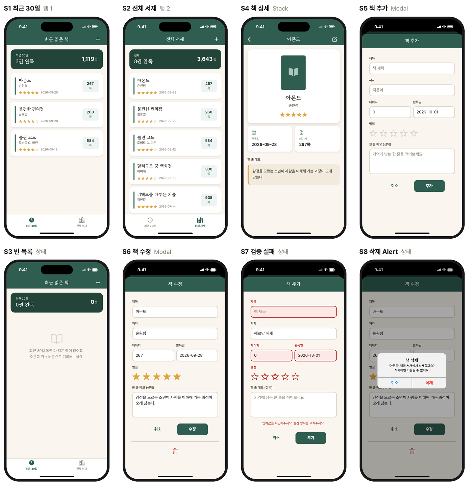
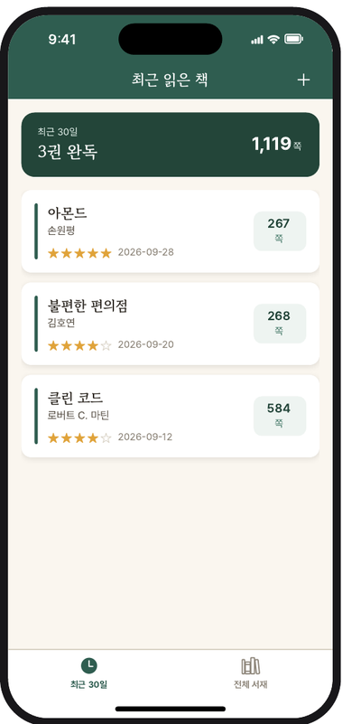
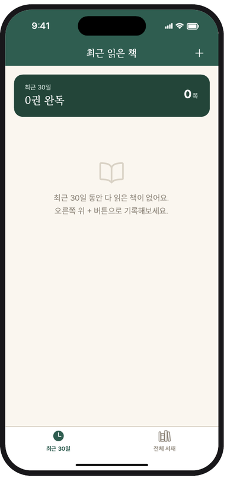
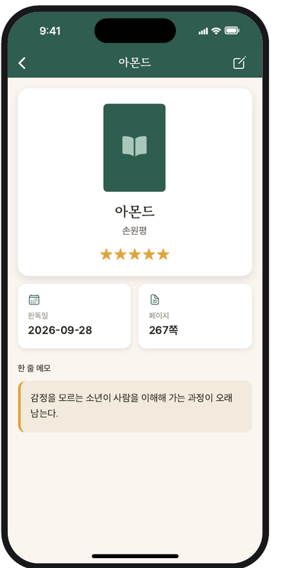
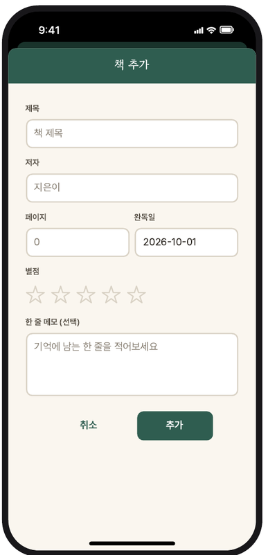
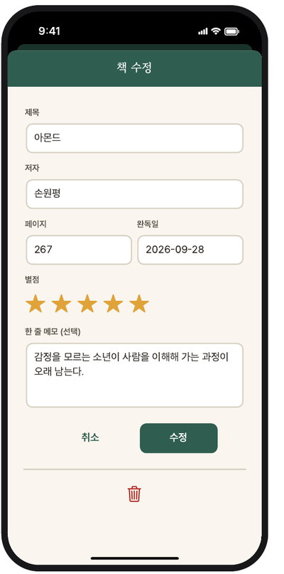
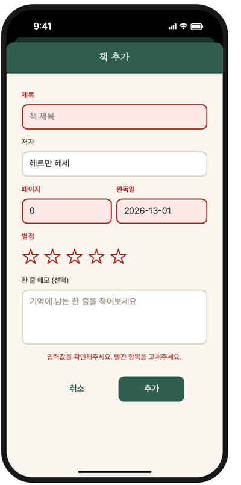
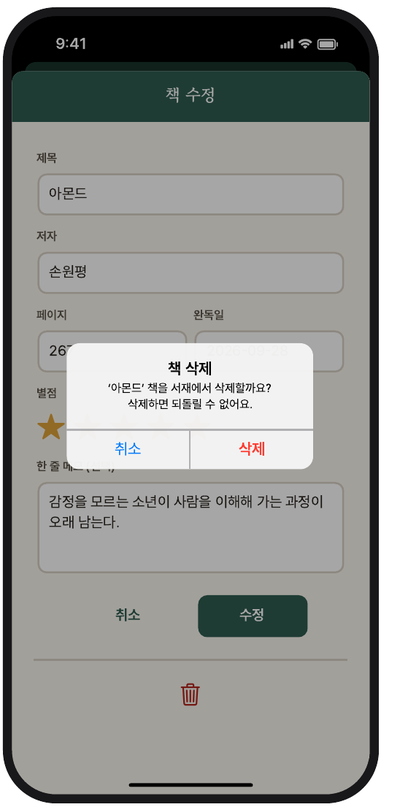

# 📖 책갈피 (Bookmark)

다 읽은 책을 기록하고 돌아보는 **React Native 독서 기록 앱**입니다.
책을 추가 · 수정 · 삭제(CRUD)하고, **최근 30일**과 **전체 서재** 두 탭에서 기록을 모아 볼 수 있습니다.

> Context API + useReducer 상태 관리, React Navigation(Stack · Bottom Tab · Modal), 폼 입력 검증을 복습하기 위한 학습용 프로젝트입니다.

<br>

## 목차

- [화면 미리보기](#화면-미리보기)
- [주요 기능](#주요-기능)
- [화면별 설명](#화면별-설명)
- [기술 스택](#기술-스택)
- [프로젝트 구조](#프로젝트-구조)
- [아키텍처](#아키텍처)
- [시작하기](#시작하기)

<br>

## 화면 미리보기



> 화면 이미지는 와이어프레임(iPhone 16 · 393 × 852 pt 기준) 목업입니다.

<br>

## 주요 기능

| 기능 | 설명 |
|---|---|
| 📚 **최근 30일 / 전체 서재** | 하단 탭으로 최근 30일 동안 다 읽은 책과 전체 책을 나눠서 보여 줍니다. 두 목록 모두 완독일 최신순입니다. |
| 📊 **독서 요약** | 목록 위 요약 카드에 해당 기간의 완독 권수와 총 페이지 수를 보여 줍니다. |
| ➕ **책 추가** | 헤더의 `+` 버튼으로 모달을 열어 제목 · 저자 · 페이지 · 완독일 · 별점 · 한 줄 메모를 기록합니다. |
| ✏️ **책 수정** | 상세 화면의 연필 버튼으로 기존 값이 채워진 폼을 열어 수정합니다. |
| 🗑️ **책 삭제** | 수정 화면의 휴지통 → 확인 Alert → 삭제 후 목록 화면으로 돌아갑니다. |
| ✅ **입력 검증** | 잘못된 필드는 빨간색으로 표시하고 에러 문구를 띄웁니다. 통과하기 전에는 저장되지 않습니다. |

<br>

## 화면별 설명

### S1. 최근 30일 (`RecentBooks`)



- 하단 탭의 **첫 번째 화면**으로, 오늘 기준 **최근 30일 동안** 다 읽은 책만 보여 줍니다.
- 상단 요약 카드: 기간 내 **완독 권수**와 **총 페이지 수**를 보여 줍니다.
- 책 카드: 제목 · 저자 · 별점 · 완독일 · 페이지 수를 보여 주고, 누르면 **책 상세**로 이동합니다.
- 헤더 오른쪽 `+` 버튼으로 **책 추가** 모달을 엽니다.

<br clear="right" />

### S2. 전체 서재 (`AllBooks`)


- 하단 탭의 **두 번째 화면**으로, 기록한 **모든 책**을 완독일 최신순으로 보여 줍니다.
- 요약 카드에는 전체 권수와 전체 페이지 합계를 보여 줍니다.
- 원본 state를 바꾸지 않도록 **배열을 복사한 뒤 정렬**합니다.

<br clear="right" />

### S3. 빈 목록 상태



- 보여 줄 책이 없을 때 목록 자리에 **안내 문구(Fallback)** 를 보여 줍니다.
- 요약 카드는 그대로 두고 `0권 완독 · 0쪽`으로 표시합니다.

<br clear="right" />

### S4. 책 상세 (`BookDetail`)



- 목록에서 고른 책의 정보를 보여 줍니다.
- 표지 · 제목 · 저자 · 별점이 담긴 **히어로 카드**, **완독일 / 페이지** 정보 타일, **한 줄 메모** 박스로 구성됩니다.
- 헤더 제목은 책 제목으로 바뀌고, 오른쪽 **연필 버튼**으로 수정 화면을 엽니다.
- `bookId`만 전달받고, 책 데이터는 Context에서 찾아서 수정 후에도 항상 최신 값을 보여 줍니다.

<br clear="right" />

### S5. 책 추가 (`ManageBook` · 추가 모드)



- **모달**로 열리는 입력 폼입니다.
- 입력 항목: 제목 · 저자 · 페이지 · 완독일(`YYYY-MM-DD`) · 별점(1~5) · 한 줄 메모(선택, 최대 100자)
- **추가**를 누르면 목록 맨 앞에 저장되고, **취소**나 아래로 스와이프하면 이전 화면으로 돌아갑니다.

<br clear="right" />

### S6. 책 수정 (`ManageBook` · 수정 모드)



- 추가 화면과 **같은 컴포넌트**를 쓰고, `bookId`가 넘어오면 수정 모드로 동작합니다.
- 기존 값이 채워진 상태로 열리고, 버튼 문구가 **수정**으로 바뀝니다.
- 하단 **휴지통 버튼**으로 책을 삭제할 수 있습니다.

<br clear="right" />

### S7. 입력 검증 실패



- 추가 / 수정 시 규칙을 어긴 필드가 하나라도 있으면 저장하지 않습니다.
- 잘못된 필드의 라벨과 입력창을 **빨간색**으로 표시하고, 하단에 에러 문구를 보여 줍니다.

| 필드 | 통과 조건 |
|---|---|
| 제목 · 저자 | 공백 제외 1자 이상 |
| 페이지 | 정수 1 ~ 9999 |
| 완독일 | `YYYY-MM-DD` 형식 · 유효한 날짜 · 오늘 이후 아님 |
| 별점 | 1 ~ 5 |
| 메모 | 선택 (최대 100자) |

<br clear="right" />

### S8. 삭제 확인 Alert



- 수정 화면에서 휴지통을 누르면 **확인 Alert**를 띄웁니다.
- **삭제**를 누르면 책을 지우고 `popToTop()`으로 **목록 화면까지** 돌아갑니다.
- **취소**를 누르면 수정 화면에 그대로 머뭅니다.

<br clear="right" />

<br>

## 기술 스택

| 분류 | 기술 | 버전 |
|---|---|---|
| 프레임워크 | [Expo](https://expo.dev) (SDK 57) | 57.0.26 |
| | React Native | 0.86.3 |
| | React | 19.2.3 |
| 언어 | JavaScript | — |
| 네비게이션 | @react-navigation/native | 7.5.0 |
| | @react-navigation/native-stack | 7.20.0 |
| | @react-navigation/bottom-tabs | 7.20.0 |
| | react-native-screens | 4.26.2 |
| | react-native-safe-area-context | 5.7.0 |
| 상태 관리 | React Context API + `useReducer` | (React 내장) |
| UI · 리소스 | @expo/vector-icons (Ionicons) | 15.1.1 |
| | expo-font | 57.0.4 |
| | expo-splash-screen | 57.0.9 |
| | expo-status-bar | 57.0.1 |
| 폰트 | [Pretendard](https://github.com/orioncactus/pretendard) (Regular · SemiBold · Bold) | — |
| | [Gowun Batang](https://fonts.google.com/specimen/Gowun+Batang) (Bold) | — |

> 서버나 로컬 저장소는 사용하지 않습니다. 앱 내부의 더미 데이터 8권으로 시작하며, 앱을 다시 시작하면 초기화됩니다.

<br>

## 프로젝트 구조

```
Bookmark
├── App.js                    # 폰트 로딩 · Context Provider · 네비게이션 구성
├── Screens/
│   ├── RecentBooks.js        # S1 · S3  최근 30일 탭
│   ├── AllBooks.js           # S2 · S3  전체 서재 탭
│   ├── BookDetail.js         # S4       책 상세
│   └── ManageBook.js         # S5 ~ S8  책 추가 / 수정 / 삭제 (모달)
├── components/
│   ├── UI/                   # Button · IconButton · StarRating
│   ├── BooksOutput/          # BooksSummary · BookItem
│   ├── BookDetail/           # InfoTile
│   └── ManageBook/           # BookForm · Input
├── store/
│   └── book-context.js       # BookContext · bookReducer · BooksContextProvider
├── models/
│   └── book.js               # Book 클래스
├── data/
│   └── dummy-data.js         # 초기 더미 데이터 8권
├── constants/
│   └── GlobalStyles.js       # 컬러 · 타이포 · 그림자 토큰
├── utils/
│   ├── date.js               # getFormattedDate · getDateMinusDays
│   └── format.js             # formatNumber (천 단위 콤마)
└── assets/fonts/             # Pretendard · Gowun Batang
```

<br>

## 아키텍처

### 네비게이션

```
BooksContextProvider
└─ NavigationContainer
   └─ Stack.Navigator
      ├─ BottomTab.Navigator (headerShown: false)
      │   ├─ RecentBooks   "최근 30일"
      │   └─ AllBooks      "전체 서재"
      ├─ BookDetail        params { bookId }
      └─ ManageBook        presentation: "modal" · params { bookId? } → 있으면 수정 모드
```

| 출발 | 동작 | 도착 |
|---|---|---|
| 탭 화면 | 헤더 `+` | ManageBook (추가) |
| 탭 화면 | 책 카드 | BookDetail |
| BookDetail | 헤더 연필 | ManageBook (수정) |
| ManageBook | 취소 / 추가 / 수정 | 직전 화면 (`goBack`) |
| ManageBook | 삭제 확인 | 탭 화면 (`popToTop`) |

### 데이터 & 상태

```js
// Book
{ id, title, author, page, finishedDate /* Date */, rating /* 1~5 */, memo }

// BookContext
{ books, addBook(bookData), updateBook(id, bookData), deleteBook(id) }
```

- `bookReducer`가 `ADD` · `UPDATE` · `DELETE` 액션을 처리하고, 항상 **새 배열**을 반환합니다 (불변 업데이트).
- 화면 사이에는 `bookId`만 전달하고, 각 화면이 Context에서 필요한 데이터를 직접 읽습니다.
- 폼에 입력 중인 값은 Context가 아니라 `BookForm` 안의 **로컬 state**로 관리하고, 제출할 때만 Context에 반영합니다.

<br>

## 시작하기

### 요구 사항

- Node.js (LTS 권장)
- iOS 시뮬레이터(Xcode) 또는 Android 에뮬레이터, 혹은 실기기의 [Expo Go](https://expo.dev/go)

### 설치 및 실행

```sh
git clone https://github.com/ios-carki/Bookmark_RN.git
cd Bookmark_RN
npm install
npx expo start
```

실행 후 터미널에서 `i`(iOS) · `a`(Android)를 누르거나, Expo Go로 QR 코드를 스캔합니다.

| 스크립트 | 설명 |
|---|---|
| `npm start` | Expo 개발 서버 실행 |
| `npm run ios` | iOS 시뮬레이터로 실행 |
| `npm run android` | Android 에뮬레이터로 실행 |
